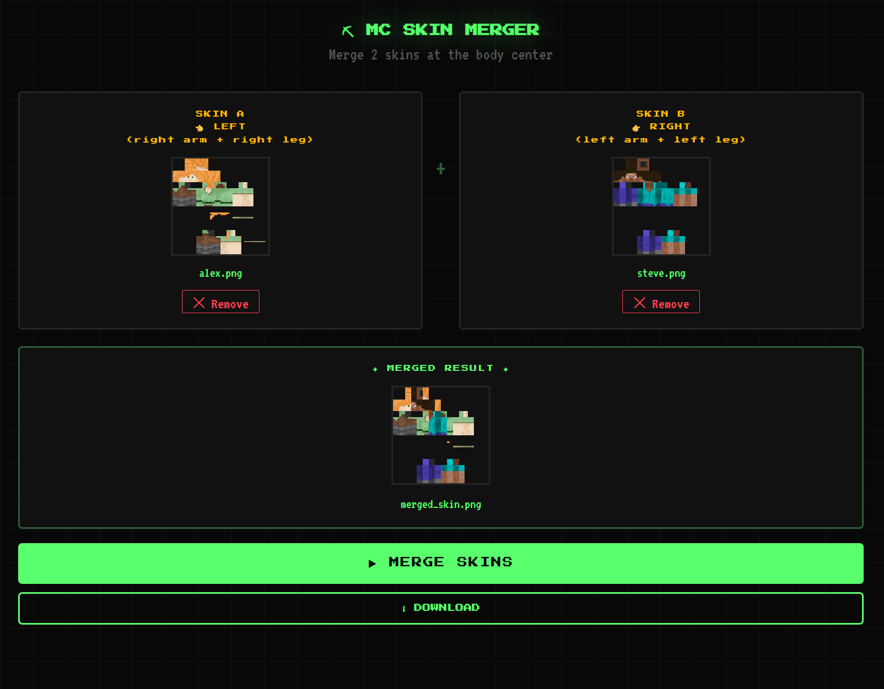

# MC Skin Merger

A browser-based tool to merge two Minecraft skins at the body center.

## Live Version

Use it online: [https://aritsulynn.github.io/mc-skin-merger/mc-skin-merger.html](https://aritsulynn.github.io/mc-skin-merger/mc-skin-merger.html)

## Usage

1. Open `mc-skin-merger.html` in any modern browser
2. Drag and drop or select **Skin A** (left side — right arm & leg)
3. Drag and drop or select **Skin B** (right side — left arm & leg)
4. Click **MERGE SKINS**
5. Download the merged result

## How It Works

The merger splits each skin at the body center and combines:

- **Skin A** → left arm, right leg, torso center, head center
- **Skin B** → right arm, left leg, torso center, head center

This lets you create hybrid skins using parts from two different sources.

## Requirements

- Browser with Canvas API support
- Input skins must be **PNG 64×64** (standard Minecraft skin format)
